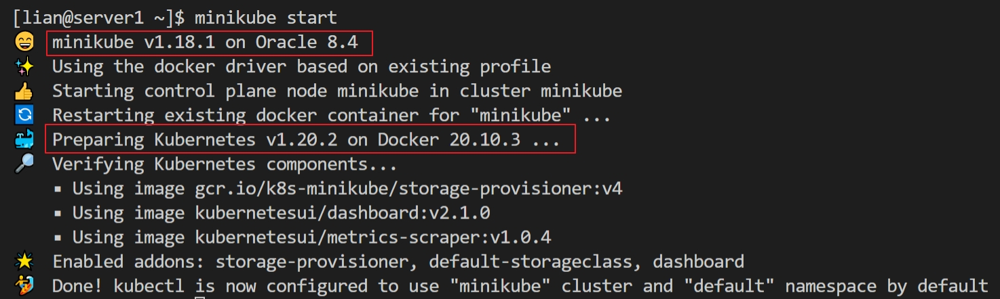

# How to Quickly Check Authorization(RBAC) in Kubernetes?

All right welcome back to the channel my name is Lian Duan and i am a content creator based here in MD

My goal with the channel is to be a resource to DevOps creatives through,
tutorials behind the scenes content and honest podcasts.

So if you are into that sort of a thing make sure you subscribe to join the creative crew, it really goes a long way towards supporting this channel and it makes sure that you never miss out. 

All video related markdown and YAML files are in my github, the links are in below.

Today, we're going to be talking about How to Quickly Quickly Check Authorization(RBAC)?


## Video Topics  is 
- My Demo ENV Detail    
- Quickly Check Authorization(RBAC) in Kubernetes
  

## First topic, Demo ENV Detail

I'd like to show my demo env. 
- My linux box is Oracle Linux Server 8.4. My login user is Lian who is able to run docker,minikube  and sodu comands.
  -You see `cat /etc/oracle-release` my oracle linux version. if you use different linux version, and run into same errors in your execise, 90% issue released permissions. Such as: file permissions or user permissions.  

- Run Minikube start command to retrieve Minikube and Kubernetes Version   
  

- There are two Related Videos.  
  - [Kubernetes Security Role Based Access Control](https://youtu.be/r05cPdoLoLw)  have background of RBAC
  - [How to Install Elasticsearch, Kibana,Logstash, Filebeat and Java App on Minikube](https://youtu.be/vN0BrVvmUxc) include why Filebeat needs RBAC in deployment process?
   
  
## Second topic, Quickly Check Authorization(RBAC) in Kubernetes
Command line and creating a resource both can Check Authorization(RBAC) in Kubernetes. 
Check means check k8s resource and verbs.
- We go command line first, 
  -   Check Authorization(RBAC) Command  is 
  - ' kubectl auth can-i '. The command is able to check User or ServiceAccount API Accesses.  
- The second way is creating a SelfSubjectAccessReview to Check API Access 

Why you want check Authorization in Kubernetes? scenarios are, 
If you are dev, before you deployment  pod, you can  check a ServiceAccount has all need resources and verbs.
or you are a k8s admin, you like to verify a k8s user account, before you send the account to your coworker. 

The http verbs and K8s API request verbs mapping can help you  do the check process. 
Let's go though the list.
There two columns http verbs and request verbs.


-  https://kubernetes.io/docs/reference/access-authn-authz/authorization/#determine-the-request-verb   
-     

   
  
### Next run  Hands On Demo,
#### Create  ClusterRole, ServiceAccount, and RoleBinding for RBAC
The goal is create  ClusterRole, ServiceAccount, and RoleBinding. 
After creating is completed, the filebeat ServiceAccount  is able to get namespaces, pods, and  nodes resource in  elk namespace.   

The YAML file has resources create detail, more info is in video [Kubernetes Security Role Based Access Control](https://youtu.be/r05cPdoLoLw). 

Next, go to yaml folder to apply filebeat-role-v1.yaml.

run  `kubectl apply -f filebeat-role-v1.yaml` to create RBAC
you see the resources are created.


#### we jump into  Authorization Verification step
How to do Authorization Verification? we can run command line or create a resource to check.

- Let's try command first, use kubectl auth can-i to verity filebeat serviceaccount  .
   
  - verify list pods action, the command is  `kubectl auth can-i list pods --namespace elk --as means run command  as filebeat serviceaccount in elk name space  `  the result is true. This is my expectation. 
  - next verify some thing filebeat serviceaccount can not do. create pods. The command is 

  - `kubectl auth can-i create pods --namespace elk --as system:serviceaccount:elk:filebeat`
    The result is right.   

  - and then verify, list pods action in default name space. The command is 
  - `kubectl auth can-i list pods --namespace default --as system:serviceaccount:elk:filebeat` 
  -  The result should be false. 
  -  The result is expectation.

The link has kubectl auth command syntax.
  - https://kubernetes.io/docs/reference/generated/kubectl/kubectl-commands#auth

we move to alternative way to verify Authorization
- Create a SelfSubjectAccessReview resource to check
- The command is 
```    
kubectl create -f  - --as system:serviceaccount:elk:filebeat -o yaml << EOF
apiVersion: authorization.k8s.io/v1
kind: SelfSubjectAccessReview
spec:
    resourceAttributes:
        group: "*"
        name: deployments
        verb: create
        namespace: elk
EOF
  ```    
the result should be false

Let m copy/pase to run 

- Clear Up  
   - `kubectl delete -f filebeat-role-v1.yaml`   


There is other exercise file for RBAC, you can try. 

All topic are completed. 

today I shared How to use command line and create  resource to Quickly Check Authorization(RBAC) in Kubernetes.
---------------------------------------

Thanks you for you witch the video. I hope it was help and it  was. do no forget to like it. 
If you want to be notified whenever a new video comes out then subscribe to my channel. 
If you have any question or something was not clear in the video. 
Please post them in a comment section below and i will try to answer.
Thank you and see you in the next video.


