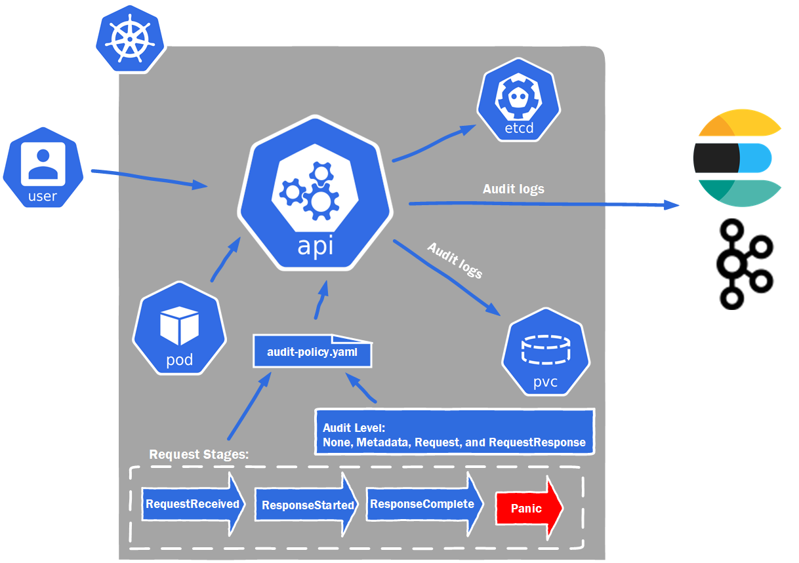

# How to Enable Kubernetes Auditing Feature in Minikube?
## Video Topics  
- Minikube Hands-on Demo ENV Detail  
- What is Kubernetes Auditing Feature? 
- How to Enable Kubernetes Auditing Feature in Minikube?

## Minikube Hands-on Demo ENV Detail
- OS version - Ubuntu 22.04 LTS     
  - `lsb_release -a`     
- Docker Version - 20.10.16     
  - `docker version`        
- Minikube version - v1.25.2   
  - `minikube version`  

## What is Kubernetes Auditing Feature?
      


- Kubernetes auditing provides a security-relevant, chronological set of records documenting the sequence of actions in a cluster. 
  - Audit policy
    - Request Stages 
      - RequestReceived 
      - ResponseStarted 
      - ResponseComplete 
      - Panic 
     - Log Levels
        - None  
          ```
            - level: None
            nonResourceURLs:
              - /healthz*
              - /version
              - /swagger*
          ```    
        - Metadata  
          ```  
            - level: Metadata
              resources:
                - group: "" # core
                  resources: ["secrets", "configmaps"]
                - group: authentication.k8s.io
                  resources: ["tokenreviews"]
          ```   

        - Request
          ```   
            - level: Request
              resources:
              - group: "" # core API group
              - group: "extensions" # Version of group should NOT be included.
          ```    


        - RequestResponse 
          ``` 
            - level: RequestResponse
            resources:
            - group: ""
              resources: ["pods"]
            
          ``` 

    [audit/audit-policy.yaml ](https://raw.githubusercontent.com/kubernetes/website/main/content/en/examples/audit/audit-policy.yaml)       
  - Audit backends  
        - Log backend    
        - Webhook backend  


## How to Enable Kubernetes Auditing Feature in Minikube?
- Create an audit-policy.yaml in .minikube/etc/ssl/certs folder
- minikube start --extra-config=apiserver.audit-policy-file=/etc/audit-policy.yaml --extra-config=apiserver.audit-log-path=-
- kubectl apply -f java-app-log-generator-deployment-v1.yaml
- kubectl logs kube-apiserver-minikube -n kube-system | grep audit.k8s.io/v1 | grep  java-app-log-generator
