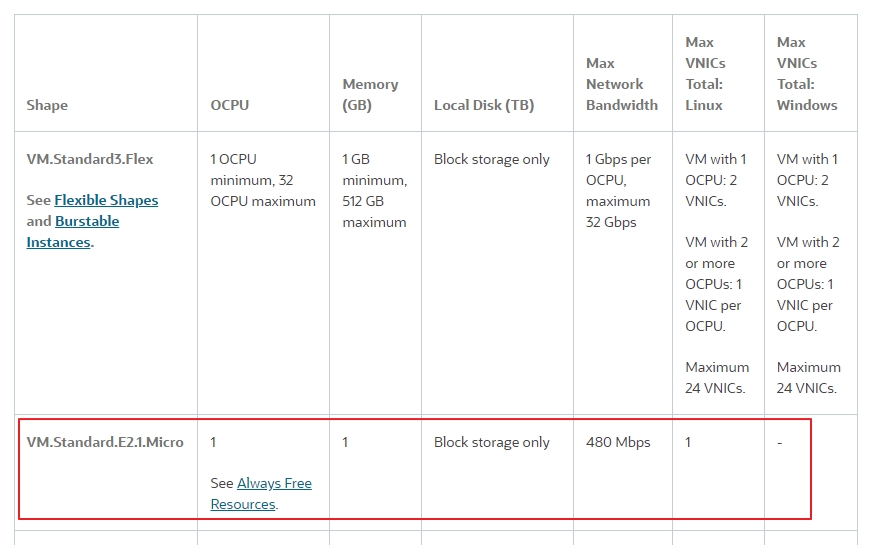
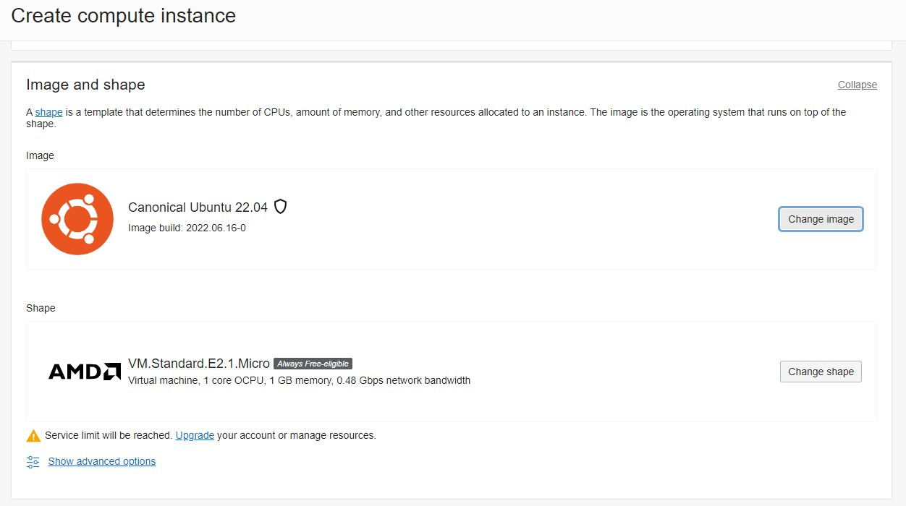

# How to Create Free Ubuntu Instance in Oracle Cloud? 
## Topics 
- Pre-request   
- Create a Free Ubuntu instance in Oracle Cloud 
- Use VS Code connection to the Instances


## Pre-request
- Oracle Cloud Free Tier Account   
 []    
 [OCI Cloud Free Tier](https://www.oracle.com/cloud/free/)   
- VS Code with SSH plugin

## Create a Free Ubuntu Instance in Oracle Cloud 
- []  
- log in (https://cloud.oracle.com)
- Create an Instance
  - Change Images to Ubuntu 22.04
    - [] 
  - Save Private Key
    - []  

  - Add Cloud-Init Script    
       ```
        #!/bin/sh  
        sudo apt update  
        sudo apt install nodejs npm -y    
       ```   
## Use VS Code Connect to The Instances
-  Add SSH Configuration in VS Code
```
Host IP
  HostName IP
  User ubuntu
  IdentityFile  XXX.key
```     
  [Connecting to a Node By Using PuTTY on Windows](https://docs.oracle.com/en/cloud/paas/event-hub-cloud/admin-guide/connecting-node-using-putty-windows.html)

-  Verify Connection

```   
nodejs --version
npm --version
```  