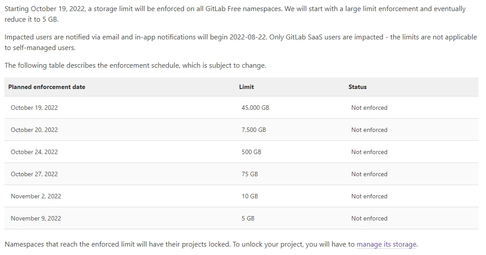
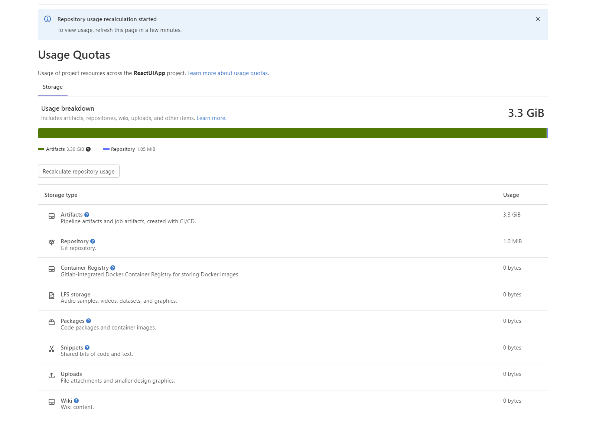
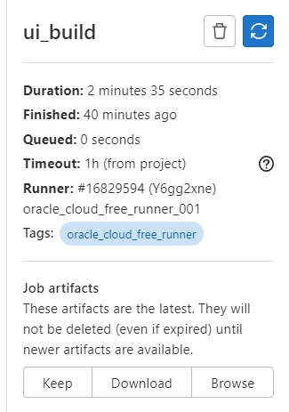
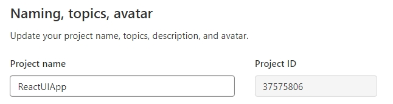
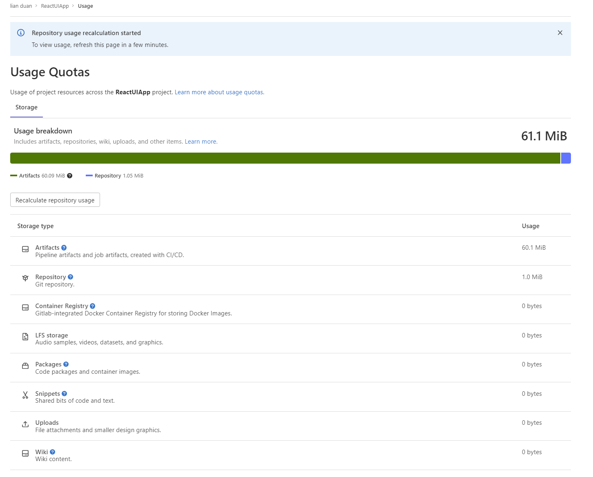

# How to Quickly Delete Job Artifacts in GitLab?    
## Topics 
- Pre-request    
- GitLab Storage Policy     
- How to Quickly Delete Job Artifacts in GitLab? 

## Pre-request
- GitLab Account
- Postman v9.28.2 

  
## GitLab Storage Policy   
- []
  - https://docs.gitlab.com/ee/user/usage_quotas.html#namespace-storage-limit-enforcement-schedule

- My React UI Project  
  - []  
## How to Quickly Delete Job Artifacts in GitLab?  
- Manually Delete Job Artifacts
    - Go to a job’s detail page.
    - On the top right of the job’s log, select Erase job log ().
    - On the confirmation dialog, select OK
    - []

- Script 
    - [carceneaux/remove_gitlab_artifacts.sh](https://gist.github.com/carceneaux/b75d483e3e0cb798ae60c424300d5a0b)
- Use Postman APIs Call
  - Personal Access Token
     - Preferences  => Personal Access Tokens
  - Project ID
    - Project => Settings => General 
    - []
  - Download and Import Collection to Postman
    - [GitLab.postman_collection.json](https://github.com/LianDuanTrain/QuickShareCICDTips/blob/main/1-7%20How%20to%20Quickly%20Delete%20Job%20Artifacts%20in%20GitLab/exerciseFile/GitLab.postman_collection.json)
  - Add Environment Parameters
      - projectsID
      - gitLabToken
  - Run Collection
  - Check Result
  - []

